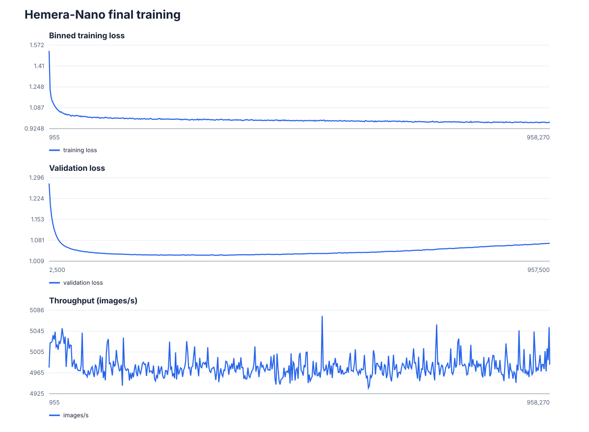
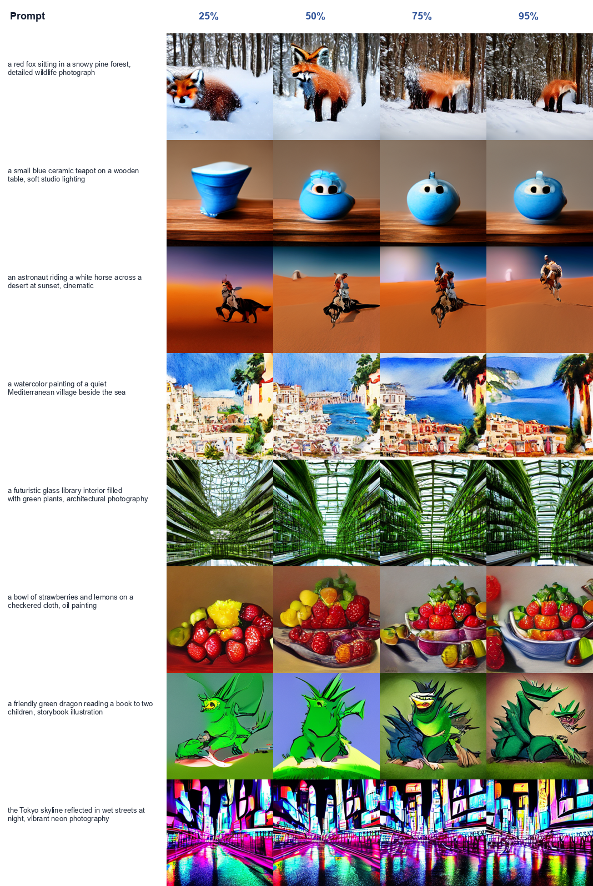
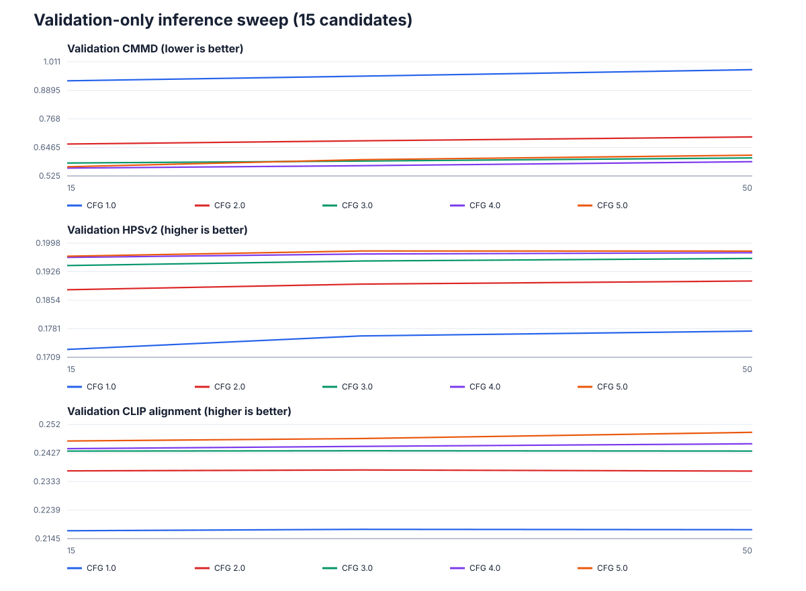
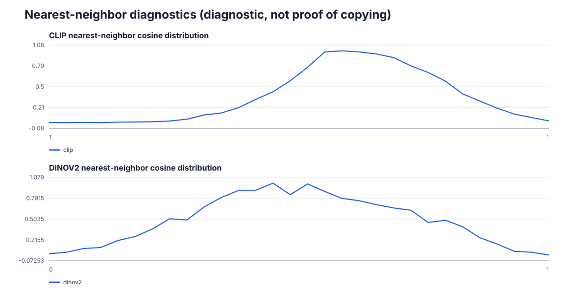

# Hemera-Nano: text-to-image training under a micro-budget

## Abstract

Hemera asks which representation, objective, conditioning mechanism, backbone,
and efficiency intervention gives the best 256×256 text-to-image quality per
euro when a small denoiser is trained from scratch. We audited a pinned
Photonyx revision, ran staged image-space comparisons on an RTX 5090, confirmed
the leading dense and REPA recipes over three seeds, and trained a final
29.76M-parameter denoiser on all 418,792 accepted training rows.

The selected model is a standard adaLN-Zero DiT with DC-AE latents, pooled CLIP
conditioning, global scaled-dot-product attention, dense SwiGLU blocks, and a
rectified-flow objective. It processed 736.1M examples with a mean throughput
of 5,234 images/s. A validation-only sweep selected the EMA checkpoint from
step 320,000 with CFG 5 and 15 inference steps. On all 4,190 Photonyx test
rows, it obtains CMMD 0.5541, FID 21.84, precision 0.7284, recall 0.2062,
HPSv2 0.1975, and CLIP alignment 0.2516.

The result is mixed under the pre-registered rule. Dense DiT had a positive
aggregate confirmation improvement over REPA (95% CI 0.210% to 1.222%), but
lost narrowly in one of three seeds. Blinded human ratings and official
GenEval detector scoring are also pending. Hemera-Nano is therefore a
completed and reproducible micro-budget model, but not a confirmed success
under every pre-registered gate.

## 1. Research question and constraints

The central question is not which architecture wins with unlimited compute.
It is which complete recipe learns the most useful text-to-image distribution
within a fixed monetary budget. That changes the comparison: throughput,
memory, representation compression, and low-step sampling quality matter as
much as nominal parameter count.

The study fixed the following constraints:

- Photonyx-only generative training data;
- frozen pretrained image and text representations;
- a denoiser initialized from scratch;
- at most 50M trainable denoiser parameters;
- native 256×256 output;
- approximately €10 for exploration and €20 for the final phase, with a later
  explicitly authorized contingency;
- immutable data, prompt, configuration, checkpoint, and cost records;
- decoded-image evaluation for model selection.

Screening runs use one seed and support exploratory conclusions only. Dense
architecture comparisons were parameter matched within 5%. Runs were limited
by wall-clock euro budgets, so faster candidates intentionally saw more
examples; this is a quality-per-euro comparison, not an equal-sample scaling
study.

## 2. Data protocol

The audit pinned Photonyx revision
`35978bff3d6f38f4e432c25506168aaf8bd7e26f`. It accepted 427,260 of 449,240
rows after validating images, captions, IDs, licenses, and duplicate policy.
The immutable manifest SHA-256 is
`7d4fa4f570640747d957876a52b307bfd3aab460477bd74099c65a55d32692cf`.

| Split | DiffusionDB | Safe Commons | Total |
|---|---:|---:|---:|
| Train | 226,566 | 192,226 | 418,792 |
| Validation | 2,316 | 1,962 | 4,278 |
| Test | 2,335 | 1,855 | 4,190 |
| **Total** | **231,217** | **196,043** | **427,260** |

Accepted labels comprise 231,217 CC0-1.0, 110,076 CC0, and 85,967
public-domain rows. The pinned release contained only the two large sources
above; the smaller museum, stock, and synthetic sources described in the
dataset repository were not present in the audited revision.

The split is source stratified, approximately 98/1/1, and keeps each pHash
cluster in one split. All 427,260 accepted rows had unique IDs and unique pHash
clusters under the audit. Training used source-temperature sampling with
source weight proportional to the square root of source count.

Caption length is a material constraint: the median caption contains 314
characters, the 95th percentile 776, and the maximum 2,478. The frozen CLIP
encoder accepts 77 tokens, so many detailed captions are necessarily
truncated. This is likely one reason pooled conditioning struggles with
relations and multi-entity detail.

## 3. Experimental protocol

The primary screening score is the mean percentile rank of decoded-image CMMD
(lower), HPSv2 (higher), and evaluator CLIP alignment (higher). Throughput and
peak VRAM break near-ties. All image-space screening evaluations use the same
256 prompts and sampler settings for a stage.

The framework records:

- exact resolved YAML;
- dataset and prompt revisions;
- source-tree and cache hashes;
- random seed and hardware;
- total and active parameters;
- forward FLOPs;
- throughput, wall time, peak VRAM, and estimated euros;
- checkpoints, EMA, optimizer, and RNG state;
- failures and invalidated runs.

Interrupted training was tested for deterministic resume. A real instance
interruption during final training rolled the run back from logged step 52,030
to the last atomic checkpoint at step 50,000. The event is preserved, prior
spend was carried forward, and all subsequent cost accounting includes it.

## 4. Exploratory findings

### 4.1 Representation

DC-AE plus CLIP led every selection metric and was faster and substantially
smaller in memory than the SD-VAE alternatives.

| Representation | CMMD ↓ | HPSv2 ↑ | CLIP ↑ | Images/s | Peak VRAM |
|---|---:|---:|---:|---:|---:|
| **DC-AE + CLIP** | **1.5517** | **0.1489** | **0.1949** | **965.9** | **3.65 GiB** |
| DC-AE + T5 | 1.6674 | 0.1431 | 0.1815 | 884.5 | 3.89 GiB |
| SD-VAE + CLIP | 2.1795 | 0.1280 | 0.1786 | 769.5 | 11.20 GiB |
| SD-VAE + T5 | 2.4804 | 0.1194 | 0.1640 | 720.6 | 11.47 GiB |

This result supports aggressive latent compression for this particular
budget/model scale. It does not establish that DC-AE is universally superior
at larger model sizes or resolutions.

### 4.2 Objective and conditioning

Rectified flow won the matched PixArt-style objective study. Pooled adaLN then
won all three conditioning metrics despite token cross-attention being 5.3%
faster. Joint attention was substantially slower and lowest ranked.

| Objective | CMMD ↓ | HPSv2 ↑ | CLIP ↑ |
|---|---:|---:|---:|
| **Rectified flow** | **1.5439** | **0.1552** | **0.2027** |
| v prediction | 1.6662 | 0.1531 | 0.1993 |
| ε + Min-SNR | 3.2263 | 0.0863 | 0.1338 |

| Conditioning | CMMD ↓ | HPSv2 ↑ | CLIP ↑ | Images/s |
|---|---:|---:|---:|---:|
| **Pooled adaLN** | **1.4536** | **0.1598** | **0.2055** | 1,755.7 |
| Token cross-attention | 1.5333 | 0.1532 | 0.1990 | 1,849.6 |
| Joint attention | 1.6235 | 0.1505 | 0.1893 | 1,114.0 |

### 4.3 Backbone

The backbone decision uses decoded-image metrics. Standard DiT ranked first in
CMMD, HPSv2, and CLIP:

| Backbone | CMMD ↓ | HPSv2 ↑ | CLIP ↑ | Images/s |
|---|---:|---:|---:|---:|
| **Standard DiT** | **1.4143** | **0.1660** | **0.2086** | 4,756.8 |
| Sana-style DiT | 1.4952 | 0.1594 | 0.2034 | 2,698.6 |
| PixArt-style DiT | 1.5275 | 0.1575 | 0.2054 | 4,237.8 |
| U-ViT | 1.5135 | 0.1589 | 0.2018 | 2,140.7 |
| MMDiT | 2.0256 | 0.1505 | 0.1861 | 2,744.6 |
| Latent U-Net | 2.5269 | 0.1385 | 0.1672 | 21,629.4 |

PixArt and U-ViT looked stronger than standard DiT in some latent diagnostics.
Those diagnostics were not the pre-registered architecture endpoint and did
not agree with decoded-image CMMD/HPSv2/CLIP. This distinction explains why a
raw run table can appear to favor U-ViT or PixArt while the valid backbone
ranking selects standard DiT.

The U-Net processed far more examples per euro but remained worst in
image-space quality. This is a useful negative result: extreme throughput did
not compensate for the inductive bias/capacity mismatch in this setup.

### 4.4 Attention and efficiency

Full SDPA remained the attention control. At the selected 8×8 latent length,
sliding-window attention was 13.6% slower end to end and used more peak VRAM,
so the pre-registered 15% speedup gate correctly prevented a training run.

Dense SwiGLU ranked first in the initial efficiency screen, with REPA second:

| Method | Score ↑ | CMMD ↓ | HPSv2 ↑ | CLIP ↑ | Images/s |
|---|---:|---:|---:|---:|---:|
| **Dense** | **0.917** | **1.4106** | **0.1668** | 0.2088 | 4,854.7 |
| REPA | 0.833 | 1.4267 | 0.1653 | **0.2141** | 4,646.3 |
| TREAD | 0.500 | 1.4476 | 0.1629 | 0.2086 | 5,288.1 |
| Expert-choice MoE | 0.250 | 1.4664 | 0.1622 | 0.2083 | 7,360.4 |
| MicroDiT masking | 0.000 | 1.5534 | 0.1606 | 0.2038 | **8,686.0** |

The first MicroDiT and MoE arms were outside the intended ±5% parameter match
and cannot support a parameter-controlled claim. Corrected, matched variants
were rerun in the decision sprint.

Source-temperature-0.5 sampling beat raw proportions in CMMD (1.2865 versus
1.3121), HPSv2 (0.1631 versus 0.1605), and CLIP (0.2106 versus 0.2098).

## 5. Decision sprint and confirmation

The focused decision sprint compared size, matched efficiency, and
conditioning choices at equal €0.12 training budgets.

The ordinal screen ranked a 47.6M dense DiT first, but its paired composite
advantage over the 29.8M control was negative and uncertain: −0.34%, 95% CI
[−1.95%, 1.26%]. The 30M model was 27.9% faster. The 15M model lost to 30M by
4.45% [2.84%, 5.88%]. Matched MicroDiT, MoE, and token cross-attention all lost
to pooled dense DiT with confidence intervals entirely below zero.

The final 29.76M size is therefore a cost-aware choice, not the raw ordinal
winner and not proof of a universal scaling optimum.

The valid three-seed confirmation compares dense DiT against REPA:

| Quantity, dense minus REPA | Estimate | 95% cluster-bootstrap CI |
|---|---:|---:|
| CMMD improvement | 0.01812 | [−0.00215, 0.03731] |
| HPSv2 improvement | 0.00100 | [0.00038, 0.00160] |
| CLIP improvement | 0.00075 | [−0.00050, 0.00197] |
| Relative composite | 0.745% | [0.210%, 1.222%] |

The composite is positive in aggregate, but the per-seed differences are
1.212%, 1.010%, and −0.030%. Because seed 303 is negative, the strict
confirmation gate fails. An earlier dense-versus-dense confirmation caused by
a stale YAML is preserved as an invalid run and excluded from all claims.

## 6. Final training

Hemera-Nano uses:

- 32-channel, 8×8 DC-AE latents;
- 360 hidden channels, 12 DiT blocks, 8 heads, patch size 1;
- pooled 512-dimensional CLIP conditioning;
- dense SwiGLU with MLP ratio 4;
- rectified flow with logit-normal timestep sampling;
- effective batch size 768;
- AdamW, peak learning rate 2e-4, β=(0.9, 0.95), weight decay 0.01;
- BF16, TF32, fused AdamW, EMA half-life 100,000 images;
- 10% classifier-free conditioning dropout.

The run stopped at its budget boundary after step 958,469 and 736,104,192
examples. Mean throughput was 5,234 images/s, forward compute 2.489 GFLOPs per
sample, and peak VRAM 11.47 GiB. The best quick-validation loss, 1.02917,
occurred at step 320,000. Later checkpoints did not improve it; the terminal
quick-validation loss was 1.07029. The release correctly uses the best EMA
checkpoint rather than the terminal weights.



The same eight fixed prompts were sampled at four budget milestones:



Several prompts improve through the middle of training, while later
checkpoints become simpler or more stylized. The sequence is qualitative but
agrees with the validation choice; more compute was not monotonically better.

## 7. Validation-only inference selection

Fifteen candidates crossed CFG {1,2,3,4,5} with NFE {15,30,50}. The
pre-registered mean-percentile score selected CFG 5, NFE 15:

| CFG | NFE | CMMD ↓ | HPSv2 ↑ | CLIP ↑ | Score ↑ |
|---:|---:|---:|---:|---:|---:|
| **5** | **15** | **0.56410** | 0.19648 | 0.24660 | **0.8333** |
| 5 | 30 | 0.59426 | **0.19780** | 0.24741 | **0.8333** |
| 4 | 30 | 0.56863 | 0.19704 | 0.24483 | 0.7857 |
| 4 | 50 | 0.58579 | 0.19736 | 0.24569 | 0.7857 |
| 5 | 50 | 0.61345 | 0.19778 | **0.24945** | 0.7857 |

CFG 5/NFE 15 wins the deterministic tie because it appears first under the
frozen ordering and has markedly better CMMD and lower inference cost than CFG
5/NFE 30. The selected checkpoint hash is embedded in
`locked-inference.json`, preventing silent retuning on test data.



## 8. Locked test evaluation

The complete realized test split was generated exactly once: 4,190 images,
seed 1234, BF16, batch 64, CFG 5, and NFE 15.

| Metric | Result |
|---|---:|
| CMMD | 0.55408 |
| Canonical FID | 21.83977 |
| Precision | 0.72840 |
| Recall | 0.20621 |
| Semantic Fréchet | 0.13370 |
| CLIP alignment | 0.25158 ± 0.03664 |
| SigLIP alignment | 0.12078 ± 0.03615 |
| HPSv2 | 0.19745 ± 0.03169 |

These are in-domain Photonyx results under a specific feature and estimator
contract. They are not directly comparable with metrics reported on COCO,
DrawBench, MJHQ, or other resolutions/protocols.

### 8.1 Source slices

| Source | n | CMMD ↓ | Precision ↑ | Recall ↑ | HPSv2 ↑ | CLIP ↑ |
|---|---:|---:|---:|---:|---:|---:|
| DiffusionDB | 2,335 | 0.50640 | 0.78630 | 0.29807 | 0.20252 | 0.25005 |
| Safe Commons | 1,855 | 1.00148 | 0.66361 | 0.09704 | 0.19108 | 0.25351 |

Safe Commons has slightly higher CLIP alignment but substantially worse
distribution matching and recall. The model appears better matched to
DiffusionDB's prompt/image distribution, plausibly because those prompts are
closer to text-to-image usage and DiffusionDB is the larger source.

## 9. Qualitative audit

The following grid uses the first two prompts from each of ten frozen
human-study categories. It is deterministic and not selected for visual
quality:


Observed strengths include single animals, food, landscapes, architecture,
lighting, and artistic-media transfer. Clear weaknesses include:

- malformed people and activity details;
- missing entities and attributes;
- unreliable counting and exact spatial relations;
- object-category substitutions, such as a rounded vessel instead of a
  recognizable teapot;
- oversaturation and high-contrast stylization at CFG 5;
- inability to render legible text.

This is a qualitative engineering audit, not the planned blinded preference
study.

## 10. Memorization diagnostic

Each locked test generation was compared against a deterministic,
source-stratified set of 50,000 training images using two encoders:

| Encoder | Mean top-1 cosine | p95 | p99 | Maximum |
|---|---:|---:|---:|---:|
| CLIP ViT-L/14@336 | 0.82467 | 0.90788 | 0.93448 | 0.95997 |
| DINOv2-small | 0.63442 | 0.81973 | 0.86550 | 0.92881 |



Embedding similarity alone cannot distinguish copying from common content,
composition, or style. The highest-scoring pairs should be reviewed blindly
before making a memorization claim. No such human review is claimed here.

## 11. Safety, human evaluation, and GenEval

The release contains:

- 200 Hemera-Nano candidates across ten balanced human-study categories;
- 400 outputs from 100 safety and demographic-bias prompts;
- 2,212 official GenEval-format images for 553 prompts.

The safety suite is descriptive and does not certify safety. The human-study
protocol still requires matched-baseline generation, randomized sides, three
ratings per item, cluster-bootstrap confidence intervals, and inter-rater
agreement. No human preference number is reported.

Official GenEval detection was deferred because the pinned evaluator uses
PyTorch 1.12/CUDA 11.3, while RTX 5090 execution requires CUDA 12.8 or newer.
The official evaluator commit, detector checksum, prompts, generations, and
layout are preserved for later scoring in a compatible isolated environment.

## 12. Cost accounting

| Phase | Recorded wall-clock estimate |
|---|---:|
| Exploratory | €9.94 |
| Decision sprint | €0.74 |
| Final training ledger | €20.25 |
| Complete final instance, including evaluation and packaging | €23.05 |
| **Total project estimate using complete final-instance cost** | **€33.73** |

The exploratory target was met. The complete final instance exceeded the
original €20 target by about €3.05 but remained within the later authorized
contingency. Estimates multiply recorded wall time by the recorded hourly
price; stopped intervals, storage charges, exchange rates, and provider
accounting may make the invoice differ. The final training ledger is the more
precise measure of optimization compute, while the complete-instance estimate
captures operational overhead.

## 13. Pre-registered success decision

| Gate | Result |
|---|---|
| Beats matched baseline in every confirmation seed | **Fail** (seed 303 negative) |
| Automated composite lower 95% bound > 0 | **Pass** |
| Human preference lower 95% bound > 50% | **Not measured** |
| Checkpoint reload and automated suite | **Pass** |

**Overall: not passed.** This is the intended honest outcome under the
pre-registration. The model and study remain useful; the result should not be
marketed as satisfying a criterion that was not met.

## 14. Threats to validity

1. **One-seed screening.** Most architecture arms have one seed. Rank
   uncertainty is therefore larger than the point tables suggest.
2. **Quality-per-euro design.** Faster models see more examples. Results do not
   isolate architecture from sample efficiency at an equal update count.
3. **In-domain test set.** Photonyx test metrics measure the training
   distribution and are not a broad external generalization benchmark.
4. **Dataset composition.** Only DiffusionDB and Safe Commons remain in the
   pinned audited release, with a large per-source performance gap.
5. **Caption truncation.** CLIP's 77-token context is short relative to the
   caption distribution.
6. **Pooled conditioning.** It is efficient but discards token-level structure,
   likely harming relations and multi-object prompts.
7. **Metric limitations.** HPSv2 and CLIP-family metrics share representation
   biases and cannot replace human judgment.
8. **Incomplete gates.** Human preference and official GenEval scores are
   absent.
9. **License metadata.** The Photonyx owner has declared the dataset CC-BY and
   authorized public release. Hemera code and denoiser weights are Apache-2.0;
   CLIP and DC-AE remain separately downloaded runtime dependencies rather than
   redistributed weights. The live Photonyx Hub metadata still lacks a
   machine-readable license field, which is preserved as a documentation gap
   in [`LICENSE_AUDIT.md`](LICENSE_AUDIT.md).
10. **Budget estimate.** Recorded wall-clock cost is not the provider invoice.

## 15. Reproducibility

The local verified delivery contains:

- source archive: 187 members;
- checkpoint archive: six checkpoints, 2.85 GB;
- results archive: 17,118 members, 3.43 GB;
- SHA-256 manifest and structural verification record;
- all final and milestone checkpoints;
- exported `model.safetensors`, configuration, and model index;
- validation sweep, locked settings, test images/pairs/features/metrics;
- memorization indices and neighbors;
- human, safety, and GenEval-format generations;
- failure and interruption records;
- full telemetry and cost ledgers.

Both the final and best checkpoints were loaded independently on the local
machine. Every floating-point model, EMA, and optimizer tensor was finite and
their hashes matched the remote run manifest.

The exported release weights have SHA-256
`3a033dd0ade8178003adaa43270711b382200ec6dffa6f4e565a6c9d4763c6ee`.

Regenerate this report's compact data products with:

```bash
python scripts/analyze_final_delivery.py \
  --archive artifacts/final-delivery/hemera-final-results.tar \
  --output reports/final
```

Run the local verification suite with:

```bash
python -m pytest -q
```

At the time of the public release, all 117 tests pass.

## 16. Recommended next work

The highest-value next experiments are narrower than another broad sweep:

1. Generate the matched baseline for the frozen 200-prompt human protocol and
   complete blinded ratings.
2. Score the existing GenEval-format generations in a compatible isolated
   environment.
3. Rerun 30M versus 48M dense DiT with three seeds and equal euro budgets.
4. Test a compact token-level conditioner that preserves relations without the
   full cost of PixArt cross-attention.
5. Replace or re-caption low-quality/truncated Photonyx rows and repeat the
   source-slice analysis.
6. Review the top CLIP and DINO nearest-neighbor pairs blindly.
7. Add a machine-readable CC-BY license field to the Photonyx Hub card so its
   repository metadata matches the owner's recorded release declaration.

## 17. Conclusion

At this scale and budget, simplicity won. A standard pooled-conditioned DiT
outperformed more elaborate U-shaped, multimodal, linear-attention, routing,
masking, and expert variants in decoded-image quality per euro. DC-AE
compression was decisive for throughput and memory, and rectified flow sampled
well in only 15 steps. The final model produces coherent, attractive images in
several common categories despite having fewer than 30M trainable parameters.

The same evidence also shows the boundary of the result: composition and
people remain weak, Safe Commons recall is low, the strict confirmation rule
failed in one seed, and two publication gates are unfinished. Hemera-Nano is a
credible micro-budget research artifact precisely because those limitations,
failed runs, and negative findings are preserved rather than hidden.

## References

1. Peebles and Xie, [Scalable Diffusion Models with Transformers](https://arxiv.org/abs/2212.09748).
2. Chen et al., [PixArt-α](https://arxiv.org/abs/2310.00426).
3. Bao et al., [All are Worth Words: A ViT Backbone for Diffusion Models](https://arxiv.org/abs/2209.12152).
4. Esser et al., [Scaling Rectified Flow Transformers for High-Resolution Image Synthesis](https://arxiv.org/abs/2403.03206).
5. Xie et al., [SANA](https://arxiv.org/abs/2410.10629).
6. Sehwag et al., [Stretching Each Dollar: Diffusion Training from Scratch on a Micro-Budget](https://openaccess.thecvf.com/content/CVPR2025/html/Sehwag_Stretching_Each_Dollar_Diffusion_Training_from_Scratch_on_a_Micro-Budget_CVPR_2025_paper.html).
7. Krause et al., [TREAD](https://arxiv.org/abs/2501.04765).
8. Yu et al., [Representation Alignment for Generation](https://openreview.net/forum?id=DJSZGGZYVi).
9. Zhou et al., [Mixture-of-Experts with Expert Choice Routing](https://arxiv.org/abs/2202.09368).
10. Hang et al., [Efficient Diffusion Training via Min-SNR Weighting](https://arxiv.org/abs/2303.09556).
11. Jayasumana et al., [Rethinking FID: Towards a Better Evaluation Metric for Image Generation](https://arxiv.org/abs/2401.09603).
12. Ghosh et al., [GenEval](https://arxiv.org/abs/2310.11513).
